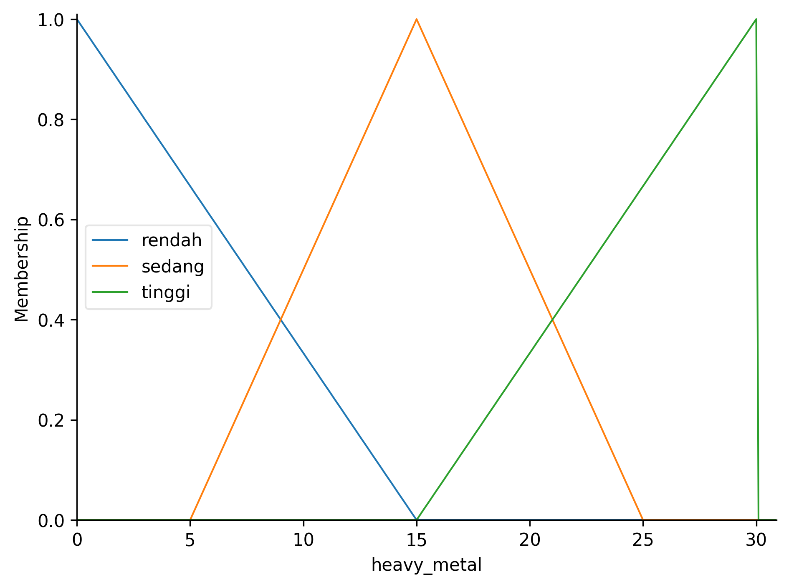
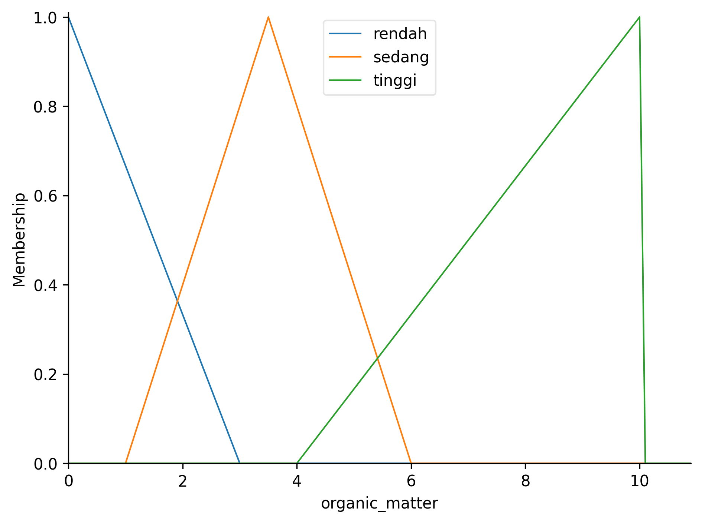

# Perhitungan Manual Metode Mamdani

**Data: pH=7.5, Nutrisi=250, Logam Berat=5, Bahan Organik=6**

## Rumus Dasar

### Fungsi Keanggotaan Segitiga trimf [a, b, c]

```
         ⎧ 0,           jika x ≤ a
         ⎪ x - a
         ⎪ ─────,       jika a < x ≤ b
         ⎪ b - a
μ(x) =   ⎨ c - x
         ⎪ ─────,       jika b < x < c
         ⎪ c - b
         ⎪ 0,           jika x ≥ c
         ⎩
```

### Operator Fuzzy

```
AND: min(A, B)    OR: max(A, B)
```

### Defuzzifikasi (COG)

```
         ∑(μ(xi) × xi)
COG = ──────────────
         ∑μ(xi)
```

## Parameter Sistem

| Variabel            | Rendah      | Sedang        | Tinggi        |
| ------------------- | ----------- | ------------- | ------------- |
| pH                  | [4,4,5.5,6] | [5.5,6.5,7.5] | [6.5,7,9,9]   |
| Nutrisi             | [0,0,150]   | [50,150,250]  | [150,350,350] |
| Logam Berat         | [0,0,15]    | [5,15,25]     | [15,30,30]    |
| Bahan Organik       | [0,0,3]     | [1,3.5,6]     | [4,10,10]     |
| **Output Kualitas** | [0,0,50]    | [20,50,80]    | [50,100,100]  |

**Catatan:**

- pH Asam menggunakan **trapezoid** [4,4,5.5,6] (shoulder kiri)
- pH Normal menggunakan **triangular** [5.5,6.5,7.5]
- pH Basa menggunakan **trapezoid** [6.5,7,9,9] (shoulder kanan)

## Visualisasi dan Rumus Fungsi Keanggotaan Global

### 1. pH Tanah


- **Asam** (trapesium kiri: [4, 4, 5.5, 6])

```
           ⎧ 1,                        jika x ≤ 4
           ⎪ (5.5 - x) / (5.5 - 4),    jika 4 < x < 5.5
μ_asam(x)= ⎨ (6 - x) / (6 - 5.5),      jika 5.5 ≤ x < 6
           ⎪ 0,                        jika x ≥ 6
           ⎩
```

- **Normal** (segitiga: [5.5, 6.5, 7.5])

```
              ⎧ 0,                        jika x ≤ 5.5
              ⎪ (x - 5.5) / (6.5 - 5.5),  jika 5.5 < x ≤ 6.5
μ_normal(x) = ⎨ (7.5 - x) / (7.5 - 6.5),  jika 6.5 < x < 7.5
              ⎪ 0,                        jika x ≥ 7.5
              ⎩
```

- **Basa** (trapesium kanan: [6.5, 7, 9, 9])

```
           ⎧ 0,                        jika x ≤ 6.5
           ⎪ (x - 6.5) / (7.0 - 6.5),   jika 6.5 < x ≤ 7.0
μ_basa(x)= ⎨ 1,                         jika 7.0 < x ≤ 9.0
           ⎪ 0,                         jika x > 9.0
           ⎩
```

---

### 2. Nutrisi


- **Rendah** (segitiga: [0, 0, 150])

```
             ⎧ 1,                        jika x = 0
             ⎪ (150 - x) / (150 - 0),    jika 0 < x < 150
μ_rendah(x)= ⎨ 0,                        jika x ≥ 150
             ⎩
```

- **Sedang** (segitiga: [50, 150, 250])

```
              ⎧ 0,                        jika x ≤ 50
              ⎪ (x - 50) / (150 - 50),    jika 50 < x ≤ 150
μ_sedang(x) = ⎨ (250 - x) / (250 - 150),  jika 150 < x < 250
              ⎪ 0,                        jika x ≥ 250
              ⎩
```

- **Tinggi** (segitiga: [150, 350, 350])

```
             ⎧ 0,                        jika x ≤ 150
             ⎪ (x - 150) / (350 - 150),   jika 150 < x < 350
μ_tinggi(x)= ⎨ 1,                         jika x = 350
             ⎪ 0,                         jika x > 350
             ⎩
```

---

### 3. Logam Berat



- **Rendah** (segitiga: [0, 0, 15])

```
             ⎧ 1,                        jika x = 0
             ⎪ (15 - x) / (15 - 0),      jika 0 < x < 15
μ_rendah(x)= ⎨ 0,                        jika x ≥ 15
             ⎩
```

- **Sedang** (segitiga: [5, 15, 25])

```
              ⎧ 0,                        jika x ≤ 5
              ⎪ (x - 5) / (15 - 5),       jika 5 < x ≤ 15
μ_sedang(x) = ⎨ (25 - x) / (25 - 15),     jika 15 < x < 25
              ⎪ 0,                        jika x ≥ 25
              ⎩
```

- **Tinggi** (segitiga: [15, 30, 30])

```
             ⎧ 0,                        jika x ≤ 15
             ⎪ (x - 15) / (30 - 15),      jika 15 < x < 30
μ_tinggi(x)= ⎨ 1,                         jika x = 30
             ⎪ 0,                         jika x > 30
             ⎩
```

---

### 4. Bahan Organik



- **Rendah** (segitiga: [0, 0, 3])

```
             ⎧ 1,                        jika x = 0
             ⎪ (3 - x) / (3 - 0),         jika 0 < x < 3
μ_rendah(x)= ⎨ 0,                        jika x ≥ 3
             ⎩
```

- **Sedang** (segitiga: [1, 3.5, 6])

```
              ⎧ 0,                        jika x ≤ 1
              ⎪ (x - 1) / (3.5 - 1),      jika 1 < x ≤ 3.5
μ_sedang(x) = ⎨ (6 - x) / (6 - 3.5),      jika 3.5 < x < 6
              ⎪ 0,                        jika x ≥ 6
              ⎩
```

- **Tinggi** (segitiga: [4, 10, 10])

```
             ⎧ 0,                        jika x ≤ 4
             ⎪ (x - 4) / (10 - 4),        jika 4 < x < 10
μ_tinggi(x)= ⎨ 1,                         jika x = 10
             ⎪ 0,                         jika x > 10
             ⎩
```

---

## Langkah 1: Fuzzifikasi

### pH = 7.5 - Penjelasan Detail

**Fungsi pH Basa: trapezoid [6.5, 7.0, 9, 9]**

- a = 6.5 (mulai naik)
- b = 7.0 (mulai plateau)
- c = 9 (akhir plateau)
- d = 9 (akhir fungsi)

**Untuk pH = 7.5:**

```
Karena 7.0 ≤ 7.5 ≤ 9, maka nilai keanggotaan = 1.0 (plateau)

μ_basa = 1.0
```

**Penjelasan angka:**

- **7.5** = nilai pH input
- **6.5** = titik mulai fungsi basa (parameter a)
- **7.0** = titik mulai plateau (parameter b)
- **9** = titik akhir plateau (parameter c dan d)
- **1.0** = nilai maksimum karena berada di area plateau

**Visualisasi pada grafik:**

```
μ(pH)
  1 |     Normal      Basa
    |       /\      /-----
    |      /  \    /
1.0 |     /    \  *  ← pH=7.5 (μ=1.0)
    |    /      \/
  0 +---+-------+-------+--→ pH
    4  5.5    6.5 7.0   9
```

### Nutrisi = 250

- μ_tinggi = (250-150)/(350-150) = 100/200 = **0.5**
- μ_sedang = μ_rendah = 0

### Logam Berat = 5

- μ_rendah = (15-5)/(15-0) = 10/15 = **0.67**
- μ_sedang = μ_tinggi = 0

### Bahan Organik = 6

- μ_tinggi = (6-4)/(10-4) = 2/6 = **0.33**
- μ_sedang = μ_rendah = 0

## Langkah 2: Evaluasi Aturan

| Aturan | Kondisi                                                       | Perhitungan       | α        |
| ------ | ------------------------------------------------------------- | ----------------- | -------- |
| 1      | pH Normal AND Nutrisi Tinggi AND Logam Rendah → Baik          | min(0, 0.5, 0.67) | 0        |
| 2      | pH (Asam OR Basa) AND Nutrisi Rendah AND Logam Tinggi → Buruk | min(1.0, 0, 0)    | 0        |
| 3      | pH Normal AND Nutrisi Sedang AND Logam Sedang → Sedang        | min(0, 0, 0)      | 0        |
| 4      | Bahan Organik Tinggi → Baik                                   | 0.33              | **0.33** |
| 5      | Bahan Organik Rendah AND Logam Tinggi → Buruk                 | min(0, 0)         | 0        |
| 6      | pH Normal AND Nutrisi Tinggi AND Logam Sedang → Sedang        | min(0, 0.5, 0)    | 0        |

## Langkah 3: Agregasi

```
α_buruk = max(0, 0) = 0
α_sedang = max(0, 0) = 0
α_baik = max(0, 0.33) = 0.33
```

## Langkah 4: Defuzzifikasi

Pada langkah ini, kita akan mencari nilai crisp (skor akhir) dari hasil fuzzy menggunakan metode Centroid (COG - Center of Gravity).

Karena hanya kategori "Baik" yang aktif dengan α = 0.33, maka proses defuzzifikasi hanya menggunakan bagian dari fungsi keanggotaan "Baik" yang dipotong pada α = 0.33.

**Fungsi Baik:** trimf [50, 100, 100]

Bentuk fungsi keanggotaan output "Baik":

- Segitiga dengan puncak di x = 100, alas dari x = 50 sampai x = 100.

Karena α_baik = 0.33, maka segitiga dipotong secara horizontal pada μ = 0.33.

### 1. Menentukan Batas Potong (x1)

Potongan segitiga pada μ = 0.33:

- Rumus garis naik: μ = (x - 50) / (100 - 50) = (x - 50) / 50
- Set μ = 0.33:

  0.33 = (x1 - 50) / 50
  x1 = 50 + 0.33 × 50 = 66.5

Jadi, segmen yang aktif adalah dari x = 66.5 sampai x = 100.

### 2. Luas Daerah Aktif (A)

Luas trapesium hasil pemotongan:

- Alas bawah: 100 - 66.5 = 33.5
- Tinggi kiri: 0
- Tinggi kanan: 0.33
- Luas = 0.5 × (alas bawah + alas atas) × tinggi
- Karena segitiga, alas atas = 0 (di x = 100, μ = 0.33), alas bawah = 33.5, tinggi = 0.33

Tapi lebih mudah:

- Luas = 0.5 × (100 - 66.5) × 0.33 = 0.5 × 33.5 × 0.33 = 5.5275

### 3. Mencari Centroid (COG)

Centroid segitiga terpotong:

- Karena hanya satu segitiga, centroid berada di tengah alas aktif:
- x_cog = (66.5 + 100) / 2 = 83.25

### 4. Perhitungan Skor Akhir

Rumus centroid (COG):

```
         ∑(μ(xi) × xi)
COG = ──────────────
         ∑μ(xi)
```

Karena hanya satu segmen aktif:

- Pembilang: luas × centroid = 5.5275 × 83.25 = 459.74
- Penyebut: luas = 5.5275

Jadi,

```
COG = 459.74 / 5.5275 = 83.25
```

### 5. Hasil Akhir

**Skor akhir = 83.25 → Kategori: Baik**

---
