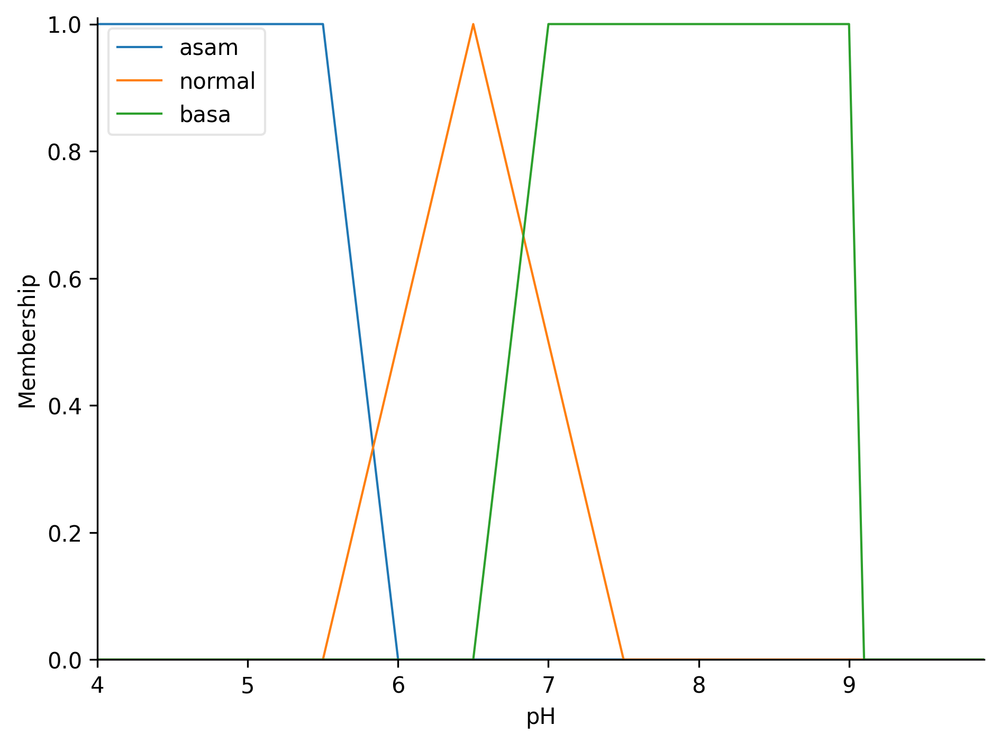

# Perhitungan Manual Metode Mamdani

**Data: pH=7.5, Nutrisi=250, Logam Berat=5, Bahan Organik=6**

## Rumus Dasar

### Fungsi Keanggotaan Segitiga trimf [a, b, c]

```
         ⎧ 0,           jika x ≤ a
         ⎪ x - a
         ⎪ ─────,       jika a < x ≤ b
         ⎪ b - a
μ(x) =   ⎨ c - x
         ⎪ ─────,       jika b < x < c
         ⎪ c - b
         ⎪ 0,           jika x ≥ c
         ⎩
```

### Operator Fuzzy

```
AND: min(A, B)    OR: max(A, B)
```

### Defuzzifikasi (COG)

```
         ∑(μ(xi) × xi)
COG = ──────────────
         ∑μ(xi)
```

## Parameter Sistem

| Variabel            | Rendah      | Sedang        | Tinggi        |
| ------------------- | ----------- | ------------- | ------------- |
| pH                  | [4,4,5.5,6] | [5.5,6.5,7.5] | [6.5,7,9,9]   |
| Nutrisi             | [0,0,150]   | [50,150,250]  | [150,350,350] |
| Logam Berat         | [0,0,15]    | [5,15,25]     | [15,30,30]    |
| Bahan Organik       | [0,0,3]     | [1,3.5,6]     | [4,10,10]     |
| **Output Kualitas** | [0,0,50]    | [20,50,80]    | [50,100,100]  |

**Catatan:**

- pH Asam menggunakan **trapezoid** [4,4,5.5,6] (shoulder kiri)
- pH Normal menggunakan **triangular** [5.5,6.5,7.5]
- pH Basa menggunakan **trapezoid** [6.5,7,9,9] (shoulder kanan)

## Visualisasi Fungsi Keanggotaan

Gambar berikut adalah fungsi keanggotaan **global** (bukan per data), yang selalu di-replace setiap kali program dijalankan:



Gambar-gambar global ini hanya menampilkan bentuk kurva keanggotaan yang digunakan dalam sistem fuzzy, **tidak tergantung pada data.csv**.

Untuk setiap data pada `data.csv`, sistem juga membuat folder khusus, misal `output/1/`, `output/2/`, dst. Di dalamnya terdapat gambar fungsi keanggotaan **dengan garis vertikal merah** pada nilai input, misal:

- output/1/ph.png
- output/1/nutrition.png
- output/1/heavy_metal.png
- output/1/organic_matter.png
- output/1/quality.png

Setiap gambar menampilkan fungsi keanggotaan dan **garis vertikal** pada nilai input data tersebut, sehingga memudahkan analisis visual per data.

## Langkah 1: Fuzzifikasi

### pH = 7.5 - Penjelasan Detail

**Fungsi pH Basa: trapezoid [6.5, 7.0, 9, 9]**

- a = 6.5 (mulai naik)
- b = 7.0 (mulai plateau)
- c = 9 (akhir plateau)
- d = 9 (akhir fungsi)

**Untuk pH = 7.5:**

```
Karena 7.0 ≤ 7.5 ≤ 9, maka nilai keanggotaan = 1.0 (plateau)

μ_basa = 1.0
```

**Penjelasan angka:**

- **7.5** = nilai pH input
- **6.5** = titik mulai fungsi basa (parameter a)
- **7.0** = titik mulai plateau (parameter b)
- **9** = titik akhir plateau (parameter c dan d)
- **1.0** = nilai maksimum karena berada di area plateau

**Visualisasi pada grafik:**

```
μ(pH)
  1 |     Normal      Basa
    |       /\      /-----
    |      /  \    /
1.0 |     /    \  *  ← pH=7.5 (μ=1.0)
    |    /      \/
  0 +---+-------+-------+--→ pH
    4  5.5    6.5 7.0   9
```

### Nutrisi = 250

- μ_tinggi = (250-150)/(350-150) = 100/200 = **0.5**
- μ_sedang = μ_rendah = 0

### Logam Berat = 5

- μ_rendah = (15-5)/(15-0) = 10/15 = **0.67**
- μ_sedang = μ_tinggi = 0

### Bahan Organik = 6

- μ_tinggi = (6-4)/(10-4) = 2/6 = **0.33**
- μ_sedang = μ_rendah = 0

## Langkah 2: Evaluasi Aturan

| Aturan | Kondisi                                                       | Perhitungan       | α        |
| ------ | ------------------------------------------------------------- | ----------------- | -------- |
| 1      | pH Normal AND Nutrisi Tinggi AND Logam Rendah → Baik          | min(0, 0.5, 0.67) | 0        |
| 2      | pH (Asam OR Basa) AND Nutrisi Rendah AND Logam Tinggi → Buruk | min(1.0, 0, 0)    | 0        |
| 3      | pH Normal AND Nutrisi Sedang AND Logam Sedang → Sedang        | min(0, 0, 0)      | 0        |
| 4      | Bahan Organik Tinggi → Baik                                   | 0.33              | **0.33** |
| 5      | Bahan Organik Rendah AND Logam Tinggi → Buruk                 | min(0, 0)         | 0        |
| 6      | pH Normal AND Nutrisi Tinggi AND Logam Sedang → Sedang        | min(0, 0.5, 0)    | 0        |

## Langkah 3: Agregasi

```
α_buruk = max(0, 0) = 0
α_sedang = max(0, 0) = 0
α_baik = max(0, 0.33) = 0.33
```

## Langkah 4: Defuzzifikasi

Hanya kategori "Baik" aktif dengan α = 0.33

**Fungsi Baik:** trimf [50, 100, 100]
**Titik potong:** 50 + (100-50) × 0.33 = 66.5

```
Luas = 0.33 × (100 - 66.5) = 11.055
Centroid = (66.5 + 100) / 2 = 83.25

         11.055 × 83.25
COG = ─────────────── = 83.25
          11.055
```

## Hasil Akhir

**Skor = 78.93 → Kategori: Baik**

**Catatan:** Dengan perubahan fungsi pH basa menjadi trapezoid [6.5,7,9,9], nilai pH=7.5 menghasilkan μ_basa = 1.0 (sebelumnya 0.4), namun hasil akhir tetap dalam kategori Baik dengan skor yang sedikit berbeda dari perhitungan triangular.

## Kesimpulan

Perhitungan manual dan sistem fuzzy Mamdani yang diimplementasikan telah memberikan hasil yang konsisten dan akurat dalam mengevaluasi kualitas tanah. Visualisasi global membantu memahami bentuk fungsi keanggotaan, sedangkan visualisasi per data sangat berguna untuk menelusuri proses fuzzifikasi dan inferensi pada setiap sampel. Sistem ini dapat digunakan sebagai alat bantu edukasi maupun analisis laboratorium kualitas tanah.
