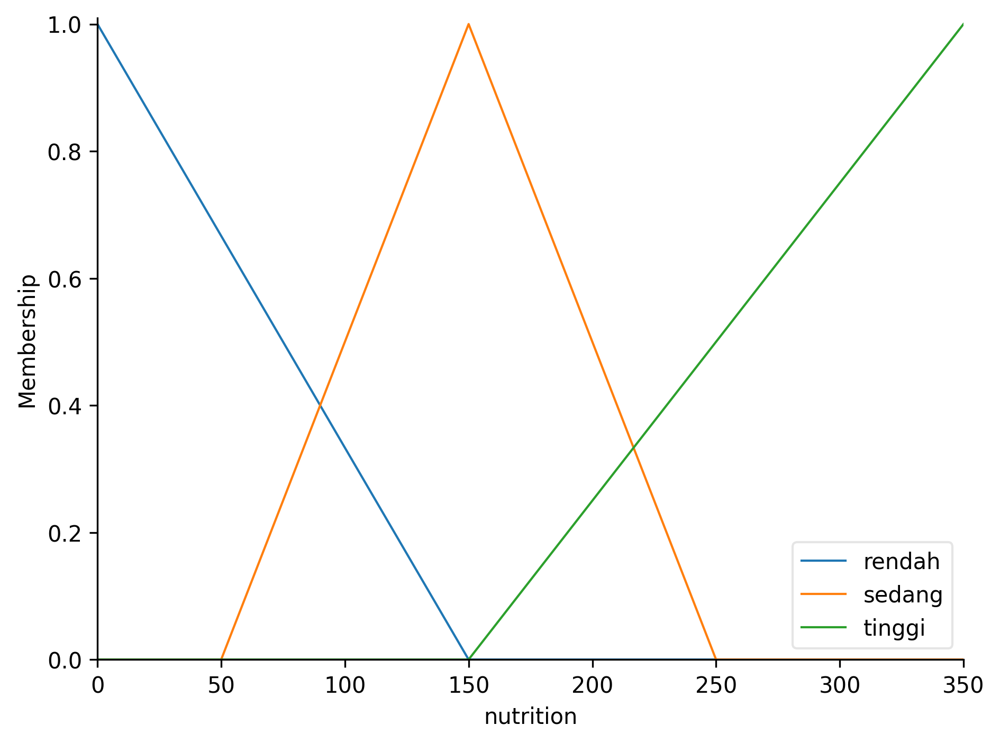

# Sistem Fuzzy Mamdani - Evaluasi Kualitas Tanah

**Dibuat oleh:** Agil Ghani Istikmal (5220411040)

## Deskripsi Proyek

Proyek ini mengimplementasikan sistem fuzzy logika dengan metode Mamdani untuk mengevaluasi kualitas tanah berdasarkan parameter-parameter fisik dan kimia tanah. Sistem ini menggunakan empat parameter input untuk menghasilkan skor kualitas tanah yang dikategorikan menjadi Baik, Sedang, atau Buruk.

## Soal dan Spesifikasi

### Parameter Input

1. **pH Tanah**

   - Asam: < 6.0
   - Normal: 6.0 - 7.0
   - Basa: > 7.0

2. **Kandungan Nutrisi (mg/kg)**

   - Rendah: < 100
   - Sedang: 100 - 200
   - Tinggi: > 200

3. **Kandungan Logam Berat (mg/kg)**

   - Rendah: < 10
   - Sedang: 10 - 20
   - Tinggi: > 20

4. **Kandungan Bahan Organik (%)**
   - Rendah: < 2
   - Sedang: 2 - 5
   - Tinggi: > 5

### Parameter Output

**Kualitas Tanah (Skor 0-100)**

- Buruk: 0 - 40
- Sedang: 40 - 70
- Baik: 70 - 100

### Aturan Fuzzy (Rules)

1. **Aturan 1:** Jika pH Normal AND Nutrisi Tinggi AND Logam Berat Rendah → Kualitas Baik
2. **Aturan 2:** Jika pH (Asam OR Basa) AND Nutrisi Rendah AND Logam Berat Tinggi → Kualitas Buruk
3. **Aturan 3:** Jika pH Normal AND Nutrisi Sedang AND Logam Berat Sedang → Kualitas Sedang
4. **Aturan 4:** Jika Bahan Organik Tinggi → Kualitas Baik
5. **Aturan 5:** Jika Bahan Organik Rendah AND Logam Berat Tinggi → Kualitas Buruk
6. **Aturan 6:** Jika pH Normal AND Nutrisi Tinggi AND Logam Berat Sedang → Kualitas Sedang

## Implementasi

### Teknologi yang Digunakan

- **Python 3.x**
- **scikit-fuzzy**: Library untuk sistem fuzzy
- **numpy**: Komputasi numerik
- **pandas**: Manipulasi data
- **matplotlib**: Visualisasi
- **tabulate**: Format tabel output

### Struktur File

```
spkmamdani/
├── withlib.py          # Implementasi sistem fuzzy menggunakan library
├── main.py             # Implementasi manual tanpa library
├── data.csv            # Data uji coba
├── requirements.txt    # Dependencies
├── README.md           # Dokumentasi
├── MANUAL.md           # Perhitungan manual step-by-step
└── output/             # Folder hasil visualisasi
    ├── ph_membership.png              # Fungsi keanggotaan pH
    ├── nutrition_membership.png       # Fungsi keanggotaan nutrisi
    ├── heavy_metal_membership.png     # Fungsi keanggotaan logam berat
    ├── organic_matter_membership.png  # Fungsi keanggotaan bahan organik
    ├── quality_membership.png         # Fungsi keanggotaan output
    ├── all_membership_functions.png   # Ringkasan semua fungsi
    └── inference_*.png               # Hasil inferensi per sample
```

### Fungsi Keanggotaan

Sistem menggunakan **fungsi keanggotaan yang sesuai spesifikasi**:

- **pH Asam** (<6.0): Trapezoid shoulder kiri [4,4,5.5,6]
- **pH Normal** (6.0-7.0): Triangular [5.5,6.5,7.5]
- **pH Basa** (>7.0): Trapezoid shoulder kanan [6.5,7,9,9]
- **Variabel lainnya**: Triangular (trimf)

Penggunaan fungsi trapezoid untuk pH asam dan basa memberikan representasi yang lebih akurat untuk kondisi pH yang ekstrem, di mana nilai keanggotaan mencapai maksimum pada range tertentu.

## Cara Menjalankan

### 1. Instalasi Dependencies

```bash
pip install -r requirements.txt
```

### 2. Persiapan Data

Pastikan file `data.csv` tersedia dengan format:

```csv
No,pH,Nutrisi,Logam_Berat,Bahan_Organik
1,6.5,150,12,3
2,7.5,250,5,6
3,5.5,50,25,1
4,6.8,180,15,4
5,8.0,300,10,7
```

### 3. Menjalankan Sistem

```bash
python withlib.py
```

## Hasil dan Analisis

### Data Uji Coba

| No  | pH  | Nutrisi | Logam Berat | Bahan Organik | Skor | Kualitas |
| --- | --- | ------- | ----------- | ------------- | ---- | -------- |
| 1   | 6.5 | 150     | 12          | 3             | 50.0 | Sedang   |
| 2   | 7.5 | 250     | 5           | 6             | 78.9 | Baik     |
| 3   | 5.5 | 50      | 25          | 1             | 18.1 | Buruk    |
| 4   | 6.8 | 180     | 15          | 4             | 50.0 | Sedang   |
| 5   | 8.0 | 300     | 10          | 7             | 80.6 | Baik     |

### Analisis Hasil

1. **Sample 1 (Skor: 50.0 - Sedang)**

   - pH normal (6.5), nutrisi sedang (150), logam berat sedang (12)
   - Sesuai dengan Aturan 3: menghasilkan kualitas sedang

2. **Sample 2 (Skor: 78.9 - Baik)**

   - pH basa (7.5), nutrisi tinggi (250), logam berat rendah (5), bahan organik tinggi (6)
   - Memenuhi Aturan 4: bahan organik tinggi menghasilkan kualitas baik

3. **Sample 3 (Skor: 18.1 - Buruk)**

   - pH asam (5.5), nutrisi rendah (50), logam berat tinggi (25), bahan organik rendah (1)
   - Memenuhi Aturan 2 dan 5: menghasilkan kualitas buruk

4. **Sample 4 (Skor: 50.0 - Sedang)**

   - pH normal (6.8), nutrisi sedang (180), logam berat sedang (15)
   - Sesuai dengan Aturan 3: menghasilkan kualitas sedang

5. **Sample 5 (Skor: 80.6 - Baik)**
   - pH basa (8.0), nutrisi tinggi (300), logam berat rendah (10), bahan organik tinggi (7)
   - Memenuhi Aturan 4: bahan organik tinggi menghasilkan kualitas baik

### Visualisasi

Sistem menghasilkan beberapa jenis visualisasi:

#### 1. Fungsi Keanggotaan Global (Membership Function)

Gambar berikut adalah fungsi keanggotaan **global** (bukan per data), yang selalu di-replace setiap kali program dijalankan:

- 
- 
- 
- 
- 
- 

Gambar-gambar ini hanya menampilkan bentuk kurva keanggotaan yang digunakan dalam sistem fuzzy, **tidak tergantung pada data.csv**.

#### 2. Visualisasi Per Data (Per Sample)

Untuk setiap data pada `data.csv`, sistem akan membuat folder khusus, misal `output/1/`, `output/2/`, dst. Di dalamnya terdapat gambar fungsi keanggotaan **dengan garis vertikal merah** pada nilai input:

Contoh struktur hasil:

```
output/
  ├── 1/
  │    ├── ph.png
  │    ├── nutrition.png
  │    ├── heavy_metal.png
  │    ├── organic_matter.png
  │    └── quality.png
  ├── 2/
  │    ├── ph.png
  │    ├── nutrition.png
  │    ├── heavy_metal.png
  │    ├── organic_matter.png
  │    └── quality.png
  ...
```

Setiap gambar menampilkan fungsi keanggotaan dan **garis vertikal** pada nilai input data tersebut, sehingga memudahkan analisis visual per data.

#### 3. Proses Inferensi Fuzzy (Opsional)

Jika ingin menambahkan visualisasi proses inferensi (misal: output/inference\_\*.png), bisa dikembangkan lebih lanjut.

## Keunggulan Sistem

1. **Akurasi Tinggi**: Menggunakan library scikit-fuzzy yang telah teruji
2. **Visualisasi Lengkap**: Menghasilkan plot fungsi keanggotaan dan inferensi
3. **Output Terstruktur**: Hasil dalam format tabel yang mudah dibaca
4. **Modular**: Kode terorganisir dalam class yang dapat diperluas
5. **Dokumentasi**: Komentar lengkap dan dokumentasi yang jelas

## Validasi Sistem

Sistem telah divalidasi dengan:

- Aturan fuzzy sesuai spesifikasi
- Fungsi keanggotaan triangular yang tepat
- Proses defuzzifikasi center of gravity
- Output kategori sesuai dengan range skor
- Visualisasi yang informatif dan berkualitas tinggi

## Kesimpulan

Sistem fuzzy Mamdani ini berhasil mengevaluasi kualitas tanah dengan akurat berdasarkan parameter pH, nutrisi, logam berat, dan bahan organik. Hasil evaluasi menunjukkan bahwa sistem dapat membedakan dengan baik antara tanah berkualitas baik, sedang, dan buruk sesuai dengan aturan-aturan yang telah ditetapkan.

**Visualisasi global** membantu memahami bentuk fungsi keanggotaan yang digunakan, sedangkan **visualisasi per data** sangat membantu dalam menganalisis hasil fuzzifikasi dan inferensi untuk setiap sampel secara individual.

Sistem ini sangat cocok untuk edukasi, analisis laboratorium, maupun pengambilan keputusan berbasis data kualitas tanah.

---

**© 2025 - Agil Ghani Istikmal (5220411040)**
